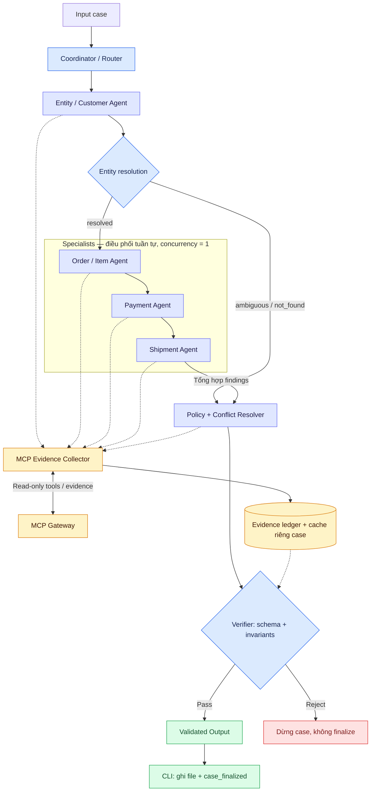
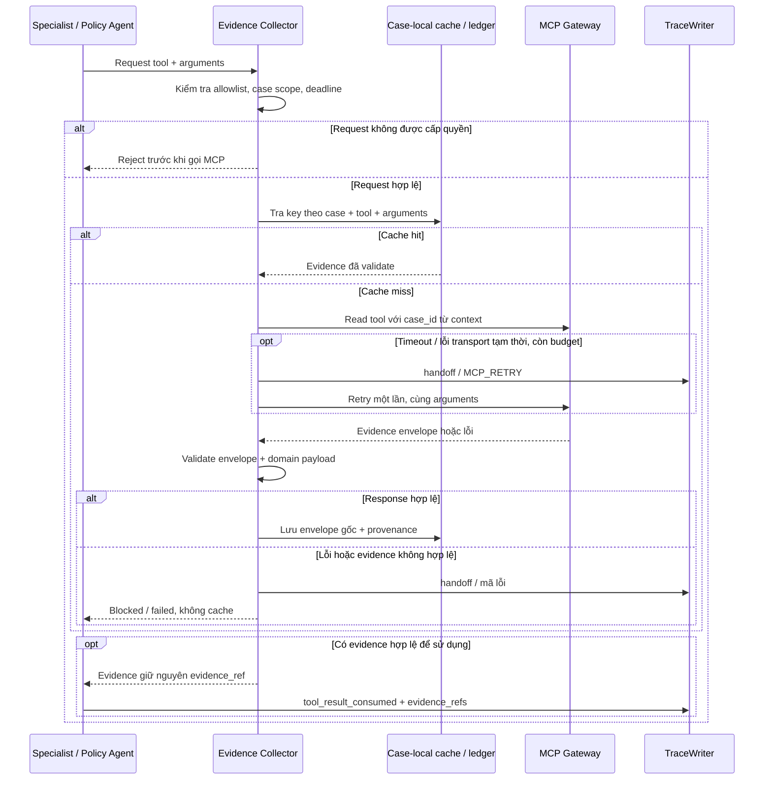

# AIGANG Architecture Record

## 1. Phạm vi và trạng thái

Tài liệu này chốt thiết kế A2A và public contracts cho bước thiết kế. Đây là đặc tả triển khai, không phải mô tả một solver đã hoạt động. `src/student_agent/workflow.py::solve_case(case, gateway, trace)` hiện vẫn là stub; không tạo output giả để thay thế nghiệp vụ chưa triển khai.

Chọn Python async state-machine, handoff nội bộ có kiểu dữ liệu rõ ràng, không cần framework hay server A2A riêng. A2A ở đây là giao thức phối hợp trong tiến trình, chưa phải triển khai chuẩn A2A qua mạng. Gateway là cổng đọc evidence; các agent không trực tiếp hoàn tiền hay thay đổi đơn hàng.

## 2. Luồng điều phối



Mũi tên liền thể hiện luồng điều phối hoặc dữ liệu; nét đứt thể hiện truy cập Collector/ledger. Collector trả evidence về agent gọi tool; chi tiết request/response nằm ở sơ đồ mục 6.

1. CLI ghi `case_received`; Coordinator tạo context riêng cho case và khám phá MCP tools.
2. Entity Agent dùng evidence để resolve candidate; ID trong input là gợi ý, chưa phải bằng chứng. Không chọn candidate chỉ vì đứng đầu danh sách. Một kết quả chỉ được đánh dấu `resolved` khi các định danh và ràng buộc quan sát được xác nhận duy nhất tập đơn liên quan. Thiếu rule xếp hạng thì giữ `ambiguous`, không tự đặt confidence cao.
3. Khi resolved, Coordinator giao lần lượt Order/Item, Payment, Shipment. Chọn concurrency = 1 cho bản đầu để trace và ngân sách gọi tool dễ tái lập. Có thể song song hóa sau khi có cache đồng bộ và giới hạn concurrency.
4. Mọi evidence đi qua Collector; specialist trả findings cùng liên kết claim/evidence nội bộ. Policy nhận tổng hợp, áp dụng policy evidence, giải quyết conflict và đề xuất hành động.
5. Verifier kiểm tra schema và invariant nghiệp vụ. Chỉ kết quả pass mới được trả từ `solve_case`; CLI ghi output bằng temporary file + replace rồi ghi `case_finalized`.
6. Đồ thị không có handoff quay lại Coordinator để tự tạo tác vụ mới. Chỉ retry cùng yêu cầu theo ngân sách cố định. Kết quả không hợp lệ dừng case; không sửa bằng cách bỏ field sai âm thầm.

## 3. Agent ownership và tool permissions

| Actor | Input và trách nhiệm | Quyền tool dự kiến | Output sở hữu |
| --- | --- | --- | --- |
| Coordinator/Router | Input, candidate hints; route, deadline, budget, merge | Discovery; không tự query domain | `case_id`, `schema_version`; lắp output |
| Entity/Customer | Candidate + customer hints; resolve/reject theo evidence | Read customer/order qua Collector | `entity_resolution`, `customer_context` |
| Order/Item | Resolved orders; xác minh items, sellers, liên kết thực thể | Read order/item/product/seller | `affected_entities` |
| Payment | Resolved orders và references; đối soát capture/refund | Read payment/refund | `payment_analysis` |
| Shipment | Resolved orders/items; đánh giá timeline, seller/logistics | Read shipment và order/item đã thu thập | `shipment_analysis` |
| Policy + Conflict Resolver | Findings và evidence; precedence, nguyên nhân, đề xuất | Read policy; đọc evidence đã thu thập | `assessment`, `claim_assessments` (optional), `root_cause_analysis`, `data_conflicts`, `financial_resolution`, `resolution_actions` |
| Evidence Collector | Request đã được cấp quyền; validate, cache, lưu provenance | Chỉ gọi tool đã discover và nằm trong allowlist actor | Evidence store riêng case; tổng hợp `evidence_refs` |
| Verifier | Output draft + evidence ledger | Không được gọi MCP | Pass/reject; không thêm field public |

Đây là quyền theo domain, chưa phải danh sách tên tool. Khi triển khai phải lấy catalog thật (tên, input schema, domain), lập allowlist tên chính xác cho mỗi actor. Discovery không tự cấp quyền. Không đoán tên tool, không tự cấp quyền từ mô tả do tool trả về. Collector chặn request ngoài allowlist trước khi gọi gateway; giữ `case_id` từ context thay vì cho agent ghi đè. Không truy vấn rejected candidate ở specialist downstream.

## 4. A2A protocol nội bộ

Dùng dataclass/TypedDict nội bộ, không thêm schema public mới trong `contracts/schemas/`:

| Thành phần | Fields nội bộ | Quy tắc |
| --- | --- | --- |
| Task | `case_id`, `task_id`, `sender`, `recipient`, `resolved_order_ids`, `evidence_refs`, `deadline`, `attempt` | Coordinator tạo; recipient, case và scope phải đúng; attempt tăng có giới hạn |
| Result | `case_id`, `task_id`, `actor`, `status`, `findings`, `evidence_refs`, `error_code` | status thuộc completed/blocked/failed; findings chỉ chứa field thuộc actor |
| Evidence ledger | `case_id`, `task_id`, `actor`, `tool_name`, normalized arguments, original envelope | Lưu trong bộ nhớ case, không serialize nguyên ledger vào output/trace |

Receiver đối chiếu case/task/actor, validate phần findings bằng fragment schema tương ứng và reject field lạ. Output cuối validate toàn bộ L3B schema. Không dùng message text tự do làm control instruction. Evidence `data` là dữ liệu không tin cậy, không phải chỉ thị cấp tool permission.

Chỉ truyền snapshot findings cần thiết; không chia sẻ mutable state giữa agent. Reference do MCP cấp được giữ nguyên. `task_id`/attempt có thể nằm trong `trace.attributes` dưới dạng scalar; không thêm key ngoài schema trace và không ghi nguyên A2A envelope vào trace.

## 5. Public contract lock

JSON Schema là nguồn chuẩn cao nhất. Giữ nguyên năm file đã phát hành:

| File | Áp dụng và điểm validate |
| --- | --- |
| `l3b-output-v2.schema.json` | Output L3B tại Verifier, trước ghi file và khi đóng gói |
| `l3a-output-v2.schema.json` | Giữ nguyên vì L3B tham chiếu các `$defs` của L3A |
| `trace-event-v1.schema.json` | Mỗi lần `TraceWriter.emit`, trước append JSONL |
| `submission-manifest-v2.schema.json` | Manifest từ `build_manifest`, trước ghi ZIP; variant phải khớp output version |
| `mcp-evidence-response-v1.schema.json` | Mỗi gateway response trước sử dụng/cache |

`Contracts` dùng Draft 2020-12, local registry cho `$ref`, và FormatChecker. Không thêm field ngoài `properties` ở object đóng. Không nới enum, required hoặc `additionalProperties` để hợp thức hóa output. Thay đổi breaking phải dùng version mới và cập nhật consumer có chủ đích.

Ngoại lệ được chính schema cho phép: MCP `data` không có ràng buộc cấu trúc; trace `attributes` cho key mở nhưng giá trị chỉ scalar/null và tối đa 20 properties. Vì vậy validate envelope không chứng minh domain payload đúng; adapter cần kiểm tra payload theo catalog thật. Không thêm `case_id` vào envelope MCP vì schema không cho phép; case ownership được giữ bằng request context và ledger, còn tính xác thực team/run do audit phía server xác nhận.

`contracts/schema-lock.json` ghi SHA-256 của JSON chuẩn hóa (sort keys, UTF-8, compact separators). Test phát hiện thay đổi nội dung kể cả `$defs` và phát hiện thiếu/thừa schema. CRLF/LF hoặc indentation không làm lock thay đổi. Lock là regression guard qua test/CI, không phải chống người có quyền sửa cả schema lẫn lock. Chỉ cập nhật lock khi release contract được duyệt; không tự cập nhật để test xanh.

## 6. Evidence và conflict lifecycle



Collector validate envelope -> validate domain payload -> gắn request context -> cache case-local -> specialist sử dụng -> emit `tool_result_consumed`. Không tạo/chỉnh `evidence_ref`; cùng ref có nội dung khác phải reject. Không giả định thuật toán canonicalization của `result_hash` khi server chưa công bố. Envelope không đủ để tự chứng minh chữ ký/hash hoặc ownership.

Cache key gồm case_id, exact tool name và canonical arguments. Chỉ cache response thành công đã validate; không cache timeout/lỗi. Không chia sẻ evidence giữa case hoặc run. Trace consumption cho cả cache hit để thấy agent nào dùng evidence. Mỗi event tối đa 20 refs; chia nhiều event nếu cần, còn output tối đa 30 refs. Không cắt bỏ evidence để lách giới hạn: thu hẹp điều tra hoặc dừng báo lỗi có mã.

Policy chọn source bằng policy evidence có hiệu lực và phạm vi phù hợp, không dùng quy tắc mặc định “mới nhất luôn đúng”. Ghi conflict theo đúng `field`, `sources`, `selected_source`, `resolution_code`. Khi chưa có căn cứ chọn source: `selected_source: null`, kết luận cần điều tra và không phê duyệt refund dựa trên phần còn tranh chấp. Nguồn được chọn phải nằm trong sources. Các giới hạn 5 conflicts, 5 claims, 8 actions được kiểm tra trước finalize.

## 7. Failure và efficiency policy (mục tiêu triển khai)

Ngân sách ban đầu: tối đa 24 MCP attempts/case (retry cũng tính), 15 giây/attempt, 90 giây/agent và 300 giây/case. Deadline case luôn ưu tiên. Chỉ query theo resolved scope hoặc candidate cần phân biệt; không quét toàn bộ lịch sử khi không có nhu cầu nghiệp vụ.

| Failure | Retry budget | Xử lý | Observable event / decision_code |
| --- | --- | --- | --- |
| Transport timeout/lỗi kết nối tạm thời | 1 retry, backoff 0.5s, cùng arguments | Chỉ read idempotent; hết budget trả blocked | `handoff` / `MCP_RETRY`, `MCP_EXHAUSTED` |
| Authentication/permission/invalid args | 0 | Dừng; không ghi raw exception hoặc secret vào trace | `handoff` / `MCP_REJECTED` |
| Envelope/domain payload sai | 0 | Reject response, không cache | `handoff` / `INVALID_EVIDENCE` |
| Entity ambiguous/not found | 0 retry mù | Policy nhận trạng thái blocked; không điều tra nhầm đơn | `handoff` / `ENTITY_AMBIGUOUS`, `ENTITY_NOT_FOUND` |
| Source conflict chưa giải quyết | Không gọi lặp cùng query | Giữ conflict, yêu cầu điều tra | `policy_decided` / `CONFLICT_UNRESOLVED` |
| Specialist output sai hoặc quá deadline | 0 | Không merge; dừng case | `handoff` / `INVALID_FINDINGS`, `AGENT_TIMEOUT` |
| Verifier reject | 0 | Không finalize/ghi output case | `verification_completed` / `REJECTED` |

Không tạo event type mới như `retry`/`error`: schema chỉ cho `case_received`, `task_assigned`, `tool_result_consumed`, `handoff`, `policy_decided`, `verification_completed`, `case_finalized`. Trace chỉ ghi sự kiện, mã quyết định, counts và refs; không chứa prompt, chain-of-thought, API key hay dữ liệu khách hàng nguyên bản.

Thiếu evidence không được biến thành zero capture/refund hay “không có vấn đề”. Dùng null ở payment totals nếu chưa biết. Output `insufficient_evidence` chỉ hợp lệ về nghiệp vụ khi đã điều tra thực sự và thể hiện `needs_investigation`; adapter chưa tồn tại/lỗi lập trình phải báo lỗi, không phát sinh fallback answer.

## 8. Verification invariants

Trước return, Verifier phải kiểm tra:

- JSON Schema đầy đủ, đúng case_id/version; tất cả field do đúng actor sở hữu.
- Resolved IDs không giao rejected IDs; affected orders thuộc resolved scope. Related customer orders không tự động thành affected orders.
- Evidence refs tồn tại trong ledger của case hiện tại; claim refs là tập con của output refs, mỗi kết luận có bằng chứng phù hợp domain/scope. Không coi chỉ có một ref bất kỳ là đủ chứng minh toàn bộ output.
- Shipment timeline có timezone/chronology hợp lệ; thiếu mốc thì `timeline_complete=false`. Không quy lỗi seller/logistics nếu evidence không đủ.
- Tiền dùng Decimal, đơn vị BRL; không cộng trùng transaction/capture hoặc xem split payment là duplicate. Refund lines cộng đúng recommended amount; đề xuất không vượt số còn refundable đã xác minh. Anomaly thực tế vẫn được biểu diễn, không xóa evidence vì số liệu mâu thuẫn.
- Selected source thuộc conflict sources và có policy hỗ trợ; unresolved conflict ảnh hưởng kết luận thì không khẳng định chắc chắn.
- Confidence trong [0,1], phản ánh evidence và entity ambiguity; không coi schema pass là confidence 1. Ngưỡng định lượng sẽ chốt khi có input/tool payload và dữ liệu hiệu chỉnh.
- Responsibility, cause ranking, issue, action và refund nhất quán; không đề xuất refund nếu chưa xác minh cơ sở policy và số dư.

## 9. Reproducibility và điểm tích hợp tiếp theo

Hiện có gateway envelope validation, trace validation, output/manifest validation và packaging. Chưa có agent adapters, permission enforcement, retry/budget/cache hoặc semantic Verifier; đây là công việc của bước triển khai `solve_case` theo thiết kế trên.

Không cần model/seed cho state-machine. Nếu bổ sung LLM, ghi model/version, temperature, prompt version và cấu hình ngân sách ở cấu hình nội bộ; không thêm vào public output. `pyproject.toml` hiện dùng dependency ranges, chưa pin exact versions; khi chạy bài chính thức cần lưu môi trường/lock dependency đã kiểm thử.

Kiểm tra thiết kế/contracts hiện tại (Windows):

```powershell
.venv\Scripts\python.exe -m pytest -q
.venv\Scripts\python.exe -m ruff check src tests
```

Sau khi có input release, MCP catalog và triển khai adapters:

```text
day09 validate-inputs
day09 mcp-tools
day09 run
day09 validate
day09 package --output dist/submission.zip
```

Không gọi MCP thật hay đóng gói submission trong bước thiết kế. Cần catalog và payload mẫu trước khi chốt mapping domain, candidate ranking, source precedence, mã business action và confidence calibration. Public schema không định nghĩa các quy tắc nghiệp vụ này.
